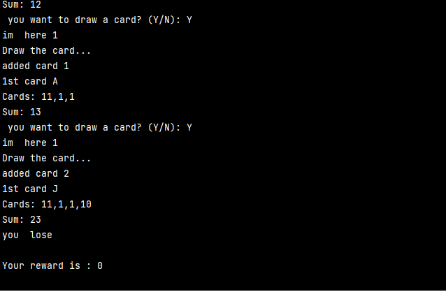

# Exercise-2
 Black-Jack js

## Table of contents

- [About](#about)
- [Archives](#archives)
- [IDE](#ide)
- [Status](#status)
- [ScreenShoots](#screen-shoots)

## About
In this repository is the solution to the 2nd Exercise; its said: 
Create an application with  the rules of a blackjack,
For this activity you will finish blackjack game adding and changing some parts:

1. App an OOP approach for Cards and Players: Define them as objects.
2. Player now will earn a price: $1000 if he makes Blackjack or the sum is between 18 and 21.
3. Set rounds: Ask player if he wants to continue playing in order to increase his/her price.

R1: Player wins! -> $1000
R2: Player wins! -> $1000 + $1000 (R1) = $2000
R3: Player loses or quit -> End of the game, Player won $2000

## Archives

> ### Black-jack.js          : Archive what contains the code to run  the application 
> ### Black-jack.html        : Archive what contains the code to run  the application in  html (incomplete)
> ### cards.js, player.js    : Archive what contains OOP from  cards and player
> ### Style.css              : Archive what controls the styles into Black-jack.html 
>
## IDE

The workshop was developed using IntelliJ Express.  

## Status
>in develop

>last update 7/14/2022.    

## Screen Shoots
The app let add cards and sums the values and detects if the card was A, J, Q, K,  and assigns the respective value.  
  
when  the app detects what sum is superior to  21 it reduces the bet in 1000 and if it is negative the bets becomes 0  

